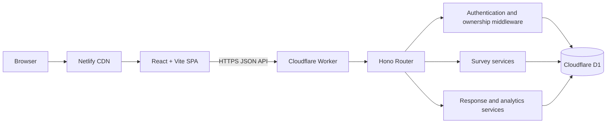
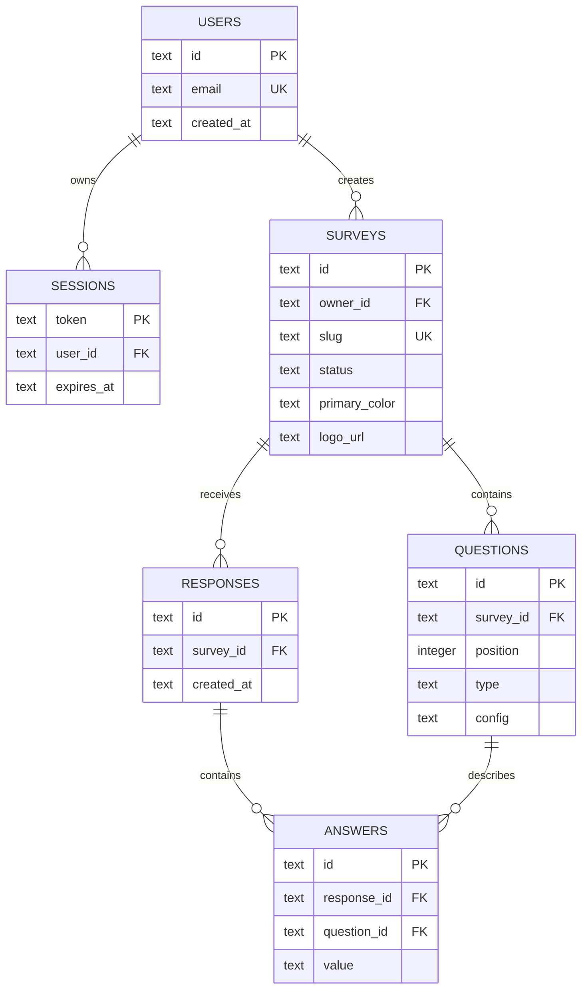

# Luma

**Branded surveys that feel like conversations.**

[Live product](https://luma-survey.netlify.app) | [API health](https://luma-api.mukulgupta3264.workers.dev/api/health)

Luma is a full-stack survey platform for creating, branding, publishing, and analyzing
high-quality surveys. It combines a focused visual builder with a calm respondent experience and
an analytics workspace designed to make response patterns easy to understand.

The product is built as a TypeScript monorepo with a React single-page application, a Hono API on
Cloudflare Workers, and relational persistence in Cloudflare D1.

## Product Overview

Luma supports the complete survey lifecycle:

1. Enter a workspace with email-based access.
2. Create or open a survey.
3. Add, remove, configure, and reorder questions.
4. Apply a primary color and logo.
5. Publish the survey to a public URL.
6. Collect anonymous responses.
7. Review aggregate insights and individual submissions.
8. Export response data as CSV.

Every new workspace is initialized with ten editable demo surveys and representative response data.
The seeded content demonstrates every supported question type, visual theme, survey state, and
analytics view without requiring manual setup.

## Core Features

### Marketing Experience

- Product-led landing page with a responsive editorial layout
- Interactive product mockup built entirely with React and CSS
- Scroll progress indicator
- Scroll-linked hero movement
- Staggered section reveals
- Feature demonstrations for building, responding, and analyzing
- Product principles and final conversion section
- Responsive navigation and mobile layouts

### Workspace Access

- Lightweight email-only sign-in
- Opaque session tokens stored in D1
- Thirty-day server-side session expiry
- Revocable sessions through sign-out
- Protected owner routes
- Automatic restoration of valid sessions
- Automatic removal of expired or unauthorized local sessions

The current email flow is intentionally lightweight. A production identity layer can replace the
sign-in endpoint with verified magic links or OAuth while retaining the existing session and
authorization model.

### Dashboard

- Workspace summary with total surveys, published surveys, and responses
- Animated count-up statistics
- Three recently updated surveys
- Quick access to survey editing and response data
- New-survey action
- Responsive cards and empty states

### Survey Library

- Complete owner-specific survey collection
- Search across titles and descriptions
- All, published, and draft filters
- Animated filter indicator and layout transitions
- Per-survey status, response count, branding preview, and update date
- Direct links to the builder and response analytics

### Survey Builder

The builder uses a three-pane desktop layout:

- **Question rail:** ordered question list, drag controls, type picker, and active selection
- **Live canvas:** branded survey preview that updates as the survey changes
- **Property panel:** question configuration and survey design controls

Builder capabilities include:

- Add and remove questions
- Drag-and-drop reordering
- Explicit move-up and move-down controls
- Required-answer toggle
- Editable question title and supporting description
- Configurable choice options
- Configurable rating scale
- Survey title and introduction editing
- Draft and published states
- Save-state feedback
- Public preview
- Share-link copying
- Responsive mobile property panel

Question reordering and selection use layout-aware motion so the interface communicates where an
item moved instead of abruptly redrawing the list.

### Question Types

| Type | Purpose | Configuration |
| --- | --- | --- |
| Short text | Names, email addresses, and concise answers | Title, description, required |
| Long text | Detailed feedback and open-ended responses | Title, description, required |
| Single select | One choice from a defined list | Editable options |
| Multi select | Multiple choices from a defined list | Editable options |
| Rating | Numeric sentiment and satisfaction scores | Maximum of 5, 7, or 10 |
| Date | Calendar-based availability or event input | Required or optional |

### Branding

Each survey owns its visual identity:

- Primary brand color
- Preset color palette
- Custom color input
- Logo URL
- Branded builder preview
- Branded public survey
- Branded progress, controls, selection states, and completion screen

Brand settings are stored with the survey, allowing one workspace to operate multiple visual
identities without global theme coupling.

### Public Survey Experience

- Public URL based on a unique survey slug
- No account required for respondents
- Published surveys only
- One question at a time
- Direction-aware forward and backward transitions
- Animated progress indicator
- Required-field validation
- Keyboard-friendly form submission
- Mobile-first answer controls
- Animated selected states
- Branded completion confirmation
- Anonymous response persistence

The public flow deliberately minimizes navigation and surrounding chrome. The respondent sees the
brand, the current prompt, and the controls needed to continue.

### Response Hub

- Workspace-wide response totals
- Ranking by response volume
- Per-survey activity bars
- Published and draft status
- Direct navigation into survey analytics
- Animated loading and data states

### Survey Analytics

- Total response count
- Question count and latest response date
- Rating averages
- Choice distribution counts
- Animated breakdown bars
- Individual response table
- Newest-first response ordering
- CSV export
- Empty states for surveys without submissions

Analytics are computed from persisted answers rather than stored as duplicated aggregates. This
keeps the data model simple and ensures the displayed results reflect the underlying submissions.

### Demo Workspace

New accounts receive an idempotent demo dataset containing:

- Ten surveys
- Published and draft examples
- Six question types
- Multiple brand colors
- Embedded logo artwork
- Thirty-nine sample responses
- Choice distributions and rating data
- Surveys suitable for testing public links, analytics, and CSV export

The seed is versioned and checked before insertion, so repeated sign-ins do not duplicate it.

## Visual System

Luma uses a warm, editorial design language intended to feel closer to a thoughtful document than
an administrative form tool.

### Color

| Role | Treatment |
| --- | --- |
| Canvas | Warm paper off-white |
| Surface | Soft translucent white |
| Ink | Near-black for strong hierarchy |
| Muted text | Warm gray |
| Coral | Primary product accent |
| Violet | Publishing and secondary metrics |
| Mint | Response and success signals |
| Survey brand | Dynamic per-survey color |

### Typography

- **Manrope:** headings, metrics, labels, and product emphasis
- **DM Sans:** body copy, controls, and longer reading
- Tight display tracking for confident headlines
- Relaxed body line height for readability
- Small uppercase eyebrows for contextual hierarchy

### Interface Graphics

The product graphics are code-driven and remain sharp at every resolution:

- Custom Luma brand mark
- Reusable line icon system
- Landing-page survey interface mockup
- Floating metric cards
- Miniature builder and analytics illustrations
- CSS-generated charts, progress bars, and option controls
- Survey cover previews generated from each survey theme
- Embedded vector demo logo
- Success rings and completion confirmation artwork
- Skeleton loading surfaces

This approach avoids a dependency on large static marketing images and keeps the visual language
consistent with the application itself.

### Motion System

Motion is implemented with [Motion for React](https://motion.dev/docs/react).

- Initial landing-page choreography
- Scroll-linked hero transformation
- Viewport-based section reveals
- Shared navigation and filter indicators
- Spring-based count-up metrics
- Card lift and press feedback
- Survey card filtering and layout transitions
- Builder reorder and selection motion
- Direction-aware respondent navigation
- Animated validation and completion states
- Analytics bar growth
- Loading-state pulses

Motion is used to explain hierarchy, state, direction, and reordering. It is not required for any
core action. The application respects the operating system's reduced-motion preference through
`MotionConfig` and CSS media rules.

## Responsive Design

The interface adapts across desktop, tablet, and mobile:

- Marketing grids collapse from multi-column layouts to stacked sections
- Dashboard statistics become vertical cards
- Survey grids move from three columns to two and then one
- Desktop sidebar becomes a bottom navigation bar
- Builder question rail is removed on compact screens
- Builder properties become a fixed lower panel
- Public survey controls expand for touch interaction
- Tables remain horizontally scrollable when necessary

## System Architecture



### Deployment Topology

| Layer | Platform | Responsibility |
| --- | --- | --- |
| Web | Netlify | Static SPA delivery, CDN caching, route fallback |
| API | Cloudflare Workers | Authentication, validation, ownership, CRUD, analytics, export |
| Database | Cloudflare D1 | Users, sessions, surveys, questions, responses, answers |

The API is stateless apart from D1. This allows Worker instances to serve requests independently at
the edge without in-memory session affinity.

## Repository Structure

```text
.
|-- api/
|   |-- migrations/
|   |   `-- 0001_initial.sql
|   |-- src/
|   |   `-- index.ts
|   |-- package.json
|   |-- tsconfig.json
|   `-- wrangler.jsonc
|-- web/
|   |-- src/
|   |   |-- components/
|   |   |   |-- app-shell.tsx
|   |   |   |-- icons.tsx
|   |   |   `-- motion.tsx
|   |   |-- lib/
|   |   |   |-- api.ts
|   |   |   |-- auth.tsx
|   |   |   `-- types.ts
|   |   |-- routes/
|   |   |   |-- app/
|   |   |   |-- login.tsx
|   |   |   |-- s/$slug.tsx
|   |   |   `-- index.tsx
|   |   |-- main.tsx
|   |   `-- styles.css
|   |-- index.html
|   |-- package.json
|   |-- tsconfig.json
|   `-- vite.config.ts
|-- biome.json
|-- netlify.toml
|-- package.json
|-- pnpm-lock.yaml
`-- pnpm-workspace.yaml
```

## Frontend Architecture

### Routing

TanStack Router provides type-safe client-side routing:

| Route | Purpose |
| --- | --- |
| `/` | Product landing page |
| `/login` | Workspace access |
| `/app` | Owner dashboard |
| `/app/surveys` | Survey library |
| `/app/surveys/:surveyId` | Survey builder |
| `/app/responses` | Workspace response hub |
| `/app/surveys/:surveyId/responses` | Survey analytics |
| `/s/:slug` | Public respondent experience |

The `/app` route acts as an authentication boundary. Public survey routes bypass owner
authentication but only return published surveys.

### State Management

- React local state owns builder edits and form input
- Authentication state is provided through a focused context
- Server data is loaded through a typed API module
- Router state owns navigation
- Motion state remains colocated with the visual interaction

The product does not use a global state library because its editing and submission flows have clear
local owners and explicit server boundaries.

### API Client

`web/src/lib/api.ts` centralizes:

- API origin configuration
- Authorization headers
- JSON serialization
- Error normalization
- Typed endpoint return values

`VITE_API_URL` points production builds to the Cloudflare Worker. During local development, Vite
proxies `/api` to port `8787`.

## Backend Architecture

The backend is a single Hono application deployed as the `luma-api` Worker.

Responsibilities include:

- Input validation
- Session lookup and expiry enforcement
- Survey ownership checks
- Survey and question persistence
- Public publication checks
- Anonymous response validation
- Analytics data retrieval
- CSV serialization
- Demo workspace initialization
- CORS enforcement

### Data Model



Question configuration and answer values are serialized as JSON inside relational rows. Ownership,
ordering, response grouping, and deletion behavior remain relational.

### Atomic Writes

Survey creation, survey updates, demo seeding, and response submission use D1 batch operations.
Survey updates replace the ordered question collection in the same batch as survey metadata. This
prevents partially saved reorder operations and keeps the builder's save boundary easy to reason
about.

### API Surface

| Method | Endpoint | Access | Purpose |
| --- | --- | --- | --- |
| GET | `/api/health` | Public | Service health |
| POST | `/api/auth/sign-in` | Public | Create or enter a workspace |
| GET | `/api/me` | Owner | Restore the current user |
| POST | `/api/auth/sign-out` | Owner | Revoke the current session |
| GET | `/api/surveys` | Owner | List owned surveys |
| POST | `/api/surveys` | Owner | Create a survey |
| GET | `/api/surveys/:id` | Owner | Load a survey and questions |
| PUT | `/api/surveys/:id` | Owner | Save survey metadata and questions |
| DELETE | `/api/surveys/:id` | Owner | Delete an owned survey |
| GET | `/api/surveys/:id/responses` | Owner | Load responses and analytics source data |
| GET | `/api/surveys/:id/export` | Owner | Download CSV |
| GET | `/api/public/surveys/:slug` | Public | Load a published survey |
| POST | `/api/public/surveys/:slug/responses` | Public | Submit an anonymous response |

## Security Model

- Opaque random session tokens
- Server-side session expiry
- Session revocation on sign-out
- Authorization header transport
- Owner checks before private survey access
- Published-status checks before public access
- Server-side question and answer validation
- Parameterized D1 queries
- Foreign-key cascades
- Restricted CORS origins
- No database credentials in the browser

The D1 database ID in `wrangler.jsonc` is a resource identifier, not a secret. Cloudflare account
credentials and API tokens must remain outside the repository.

## Technology Stack

| Area | Technology |
| --- | --- |
| Language | TypeScript |
| Frontend | React 19 |
| Build tool | Vite |
| Router | TanStack Router |
| Motion | Motion for React |
| Styling | Custom CSS |
| API | Hono |
| Runtime | Cloudflare Workers |
| Database | Cloudflare D1 |
| Web hosting | Netlify |
| Package manager | pnpm workspace |
| Formatting and linting | Biome |

## Local Development

### Requirements

- Node.js 22 or newer
- Corepack
- A Cloudflare account only when deploying remote resources

### Install

```bash
corepack pnpm install
```

### Run Web and API

```bash
corepack pnpm dev
```

Local services:

```text
Web: http://localhost:5173
API: http://localhost:8787
Health: http://localhost:8787/api/health
```

The API development command applies local D1 migrations before starting Wrangler.

### Useful Commands

```bash
corepack pnpm dev
corepack pnpm build
corepack pnpm typecheck
corepack pnpm check
corepack pnpm check:fix
corepack pnpm --filter luma-api cf-typegen
```

## Configuration

### Web

Production environment variable:

```text
VITE_API_URL=https://your-worker.workers.dev
```

The value must not include a trailing slash.

### API

`api/wrangler.jsonc` defines:

- Worker name
- D1 binding
- Database name and ID
- Migration directory
- Allowed frontend origins
- Runtime compatibility settings

Example CORS configuration:

```json
{
  "vars": {
    "CORS_ORIGIN": "http://localhost:5173,https://your-site.netlify.app"
  }
}
```

## Deployment

### Cloudflare API and D1

Authenticate:

```bash
corepack pnpm --filter luma-api exec wrangler login
```

For a new environment, create a D1 database:

```bash
corepack pnpm --filter luma-api exec wrangler d1 create survey-builder
```

Place the returned database ID in `api/wrangler.jsonc`, keeping the binding name as `DB`.

Apply migrations:

```bash
corepack pnpm --filter luma-api exec wrangler d1 migrations apply survey-builder --remote
```

Deploy the Worker:

```bash
corepack pnpm --filter luma-api exec wrangler deploy
```

### Netlify Web Application

Connect the repository to Netlify and use:

```text
Base directory: repository root
Build command: corepack pnpm build
Publish directory: web/dist
Node version: 22
```

Set:

```text
VITE_API_URL=https://your-worker.workers.dev
```

`netlify.toml` includes the build configuration and SPA fallback required for client-side routes.

After Netlify assigns the production URL, add that exact origin to `CORS_ORIGIN` and redeploy the
Worker.

## Engineering Decisions

### D1 for Persistence

Surveys, ordered questions, responses, and answers have relational access patterns. D1 provides
ownership joins, indexed response retrieval, cascading deletes, and straightforward analytics
without duplicating data across key-value records.

### Opaque Sessions

Server-stored sessions can be expired and revoked immediately. This is preferable to untracked
self-contained tokens for a product where workspace access and ownership checks protect user data.

### Local Builder State

The builder has one editing owner and one save boundary. Local state keeps interactions immediate
without introducing a global store that would duplicate server state.

### Code-Driven Visuals

Marketing graphics, previews, charts, and state illustrations use application primitives instead
of disconnected image assets. The product demonstration therefore remains representative of the
actual interface.

### Focused API

The Worker is organized around a compact route surface and shared ownership helpers. The product
can later split domains into modules without changing the external API contracts.

## Scalability Notes

- Stateless Worker requests can scale across Cloudflare's edge network
- D1 indexes cover owner lookup, slug lookup, question order, and response recency
- Batch writes reduce round trips and preserve multi-row consistency
- Static assets are delivered through Netlify's CDN
- Public and owner routes have separate authorization requirements
- Survey branding is data-driven rather than compiled into the frontend
- The API origin is environment-driven, allowing separate preview and production environments

For higher response volumes, the next architectural steps would be pagination, asynchronous export,
rate limiting, cached aggregate tables, and background analytics processing.

## Current Boundaries

- Email addresses are not verified
- Logos use URLs rather than direct uploads
- Surveys use linear question order without branching
- Analytics are calculated from response data at read time
- Response tables currently emphasize the first three questions
- The product has one workspace owner model rather than team membership and roles

These boundaries keep the current system understandable while leaving clear extension points for
magic links, R2 uploads, conditional logic, team collaboration, and deeper analytics.

## Quality

The repository uses:

- Strict TypeScript checks in both workspaces
- Biome formatting and linting
- Generated Cloudflare environment types
- Generated TanStack route types
- Production Vite builds
- Database constraints and indexes
- Reduced-motion support
- Responsive layouts
- Accessible labels, focus states, and semantic controls

Run the full validation sequence:

```bash
corepack pnpm check
corepack pnpm typecheck
corepack pnpm build
```

## Product Philosophy

Luma treats a survey as a designed conversation rather than a database form. The builder keeps
authors close to the respondent experience, branding is part of the survey model, and analytics
prioritize readable signals over dashboard density.

The result is a compact product with a clear path from question to response to decision.
